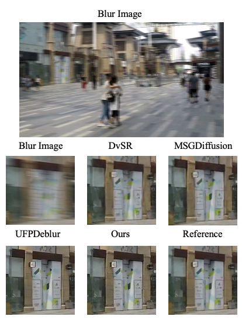
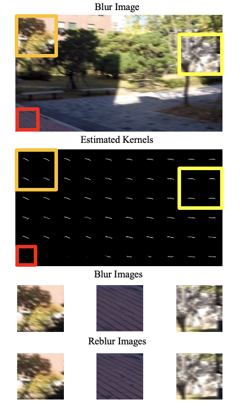
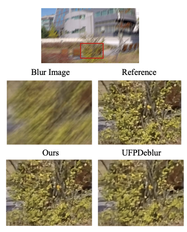

# Blind Deblurring with motion blur kernel estimation by parallel diffusion models (IPIU 2024)
# [IPIU2024_Paper.pdf](https://github.com/user-attachments/files/17594989/IPIU2024_._.pdf)

# Pipeline

# Results

## Deblur result

## Motion blur kernel result

## Perceptual quality

## Acknowledgements
The codes are built on [BlindDPS](https://github.com/BlindDPS/blind-dps) [1]. We thank the authors for sharing their codes.

